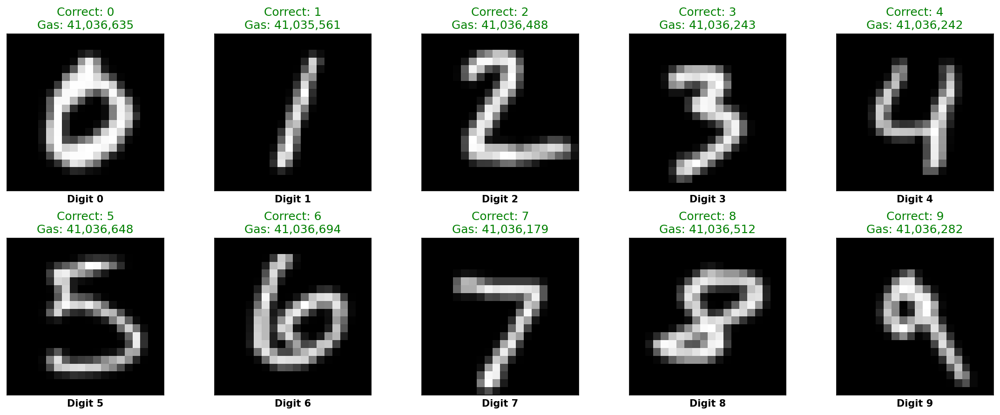
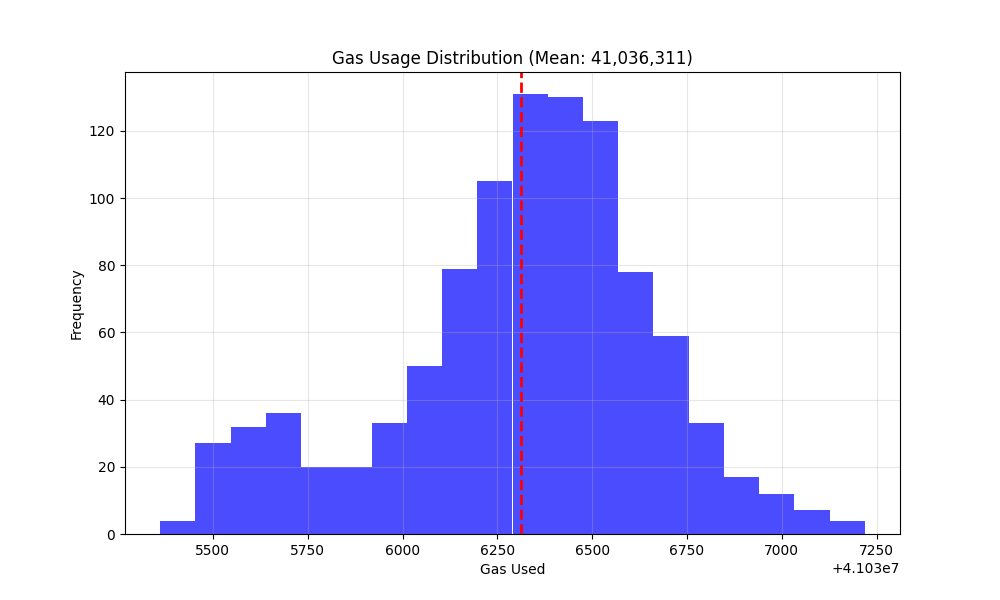
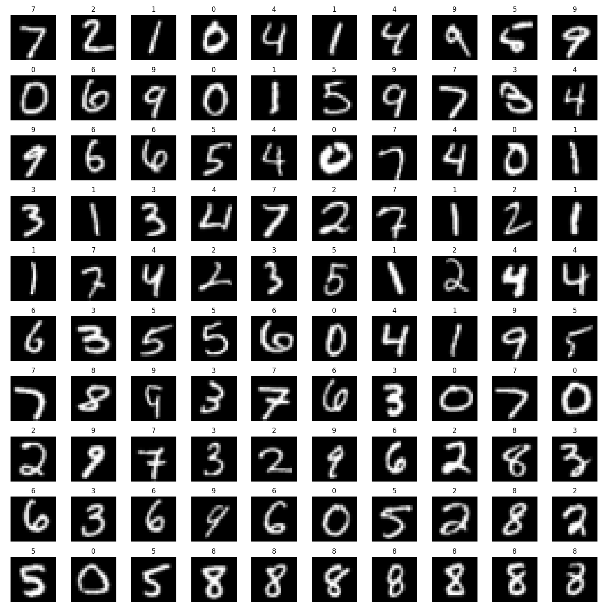

# Onchain-MNIST

A fully on-chain neural network implementation for MNIST digit classification, deployed as a smart contract.

## Overview

This project implements a neural network for MNIST handwritten digit classification directly on-chain using Solidity. The model achieves 94% accuracy while being fully executable on the EVM.



## Technical Implementation

### Neural Network Architecture

The model is a simple neural network with:
- Input layer: 400 neurons (flattened 20×20 pixel images)
- Hidden layer: Configurable size (default: 64 neurons)
- Output layer: 10 neurons (one per digit)
- Activation function: ReLU 

The weights and biases are stored directly in the contract storage after being quantized to fixed-point integers to make them compatible with EVM's integer only arithmetic.

### On-chain Execution

The inference process (forward pass) is implemented in Solidity:

1. Input image is flattened and normalized to a 400-element array of uint8 values
2. Matrix multiplication for hidden layer: `hidden = relu(input * weights1 + biases1)`
3. Matrix multiplication for output layer: `output = input * weights2 + biases2`
4. Argmax operation to determine the predicted digit

## Project Structure

- **MNISTClassifier.sol**: Main Solidity contract with the neural network implementation
- **train.py**: PyTorch script to train the model off-chain
- **deploy.py**: Script to deploy the trained model to the blockchain
- **evaluate.py**: Script to test the deployed model and compare on-chain vs off-chain results
- **bytecode.txt**: Compiled contract bytecode
- **contract_address.txt**: Address of the deployed contract
- **mnist_images/**: Directory with sample MNIST images
- **models/**: Directory containing saved PyTorch models

## Usage

### Training the Model

```bash
python train.py 
```

This trains the PyTorch model and saves it to the `models/` directory. It automatically applies the same preprocessing that will be used on-chain.

### Deploying the Model

```bash
python deploy.py --action deploy --rpc <RPC_URL> --private-key <PRIVATE_KEY>
```

This:
1. Loads the trained PyTorch model
2. Converts the weights to fixed-point representation for Solidity
3. Deploys the contract to the specified blockchain
4. Uploads model weights and biases in multiple transactions (chunked approach) to stay under gas limits (~11 million gas per chunk)
5. Saves the contract address to contract_address.txt

The deployment process uses a chunked approach to upload the model parameters, as neural network weights are often too large to fit in a single transaction. 

### Testing On-chain Inference

```bash
python evaluate.py --contract <CONTRACT_ADDRESS> --rpc <RPC_URL> --samples 100
```

## Results

Performance metrics from on-chain testing:

```
Results:
  Total images tested: 1000
  Correct predictions: 938
  On-chain accuracy: 93.80%
Gas Usage:
  Average gas per inference: 41,036,311
  Min gas: 41,035,361
  Max gas: 41,037,219
  Gas price: 0.00 Gwei
```

### Gas Usage Distribution



### Confusion Matrix

```
       0    1    2    3    4    5    6    7    8    9
    --------------------------------------------------
0 |   73    0    1    0    0    5    0    3    2    1
1 |    0  125    0    1    0    0    0    0    0    0
2 |    0    1  110    1    0    0    0    3    0    1
3 |    0    1    1  102    0    1    0    2    0    0
4 |    0    1    1    0   98    0    0    0    1    9
5 |    0    0    0    5    0   80    0    0    2    0
6 |    3    0    3    0    0    1   80    0    0    0
7 |    0    0    1    0    0    0    0   98    0    0
8 |    0    0    1    4    1    0    0    1   80    2
9 |    0    0    0    0    0    0    0    1    1   92
```

## Preprocessing Details

To ensure consistent results between off-chain and on-chain inference, images are preprocessed identically:

1. Resize to 20×20 pixels
2. Convert to grayscale
3. Normalize to 0-255 range
4. Flatten to a 400-element array



## Deployment Costs

Deploying this model runs up significant costs:

### Deployment Cost Breakdown (at ETH=$2,168)

- *Contract creation*: 0.006099015 ETH = *$13.22*
- *Biases initialization*: 0.00071944 ETH = *$1.56*
- *Weight uploads*: 
  - *W1 chunks* (26 transactions)
  - *W2 chunks* (2 transactions)
  - *W3 chunks* (1 transaction)
  - *Total weight upload cost*: 1.217933 ETH = *$2,640.48*
- *Total**: 1.224751 ETH = *$2,655.26*

The deployment process takes approximately 10 minutes to complete, with most of the cost (99%) going toward uploading the neural network weights in multiple chunks (26 chunks for the input→hidden1 layer, 2 chunks for hidden1→hidden2, and 1 chunk for hidden2→output).

## Limitations

- Pretty much unsable
- With ~41M gas per inference (eth_call only, eth block size is 36 million), this model is technically working but practically unusable in production
- While we've proven neural networks can run on-chain, your wallet will evaporate if you do this
- This is intended more as a fun exploration

## Future Improvements

- Layer-wise storage of weights to allow larger models
- Optimized gas usage through assembly
- L2 deployment for lower transaction costs
- Support for convolutional layers